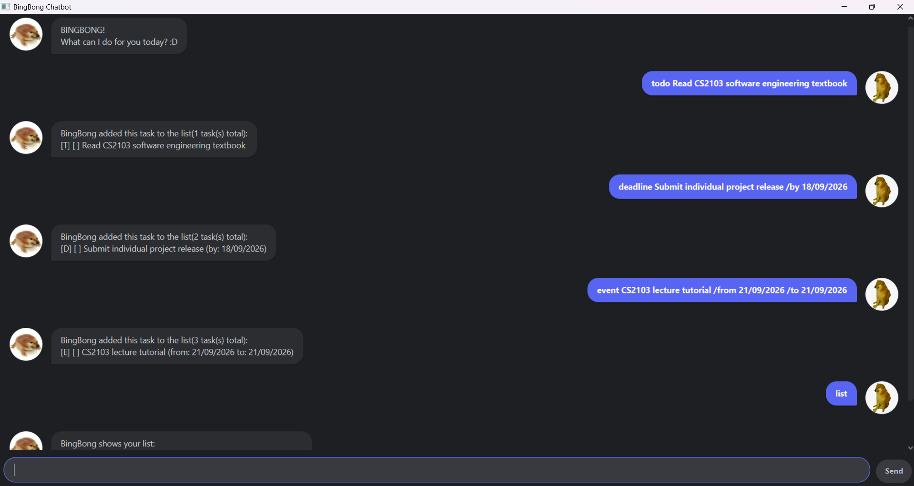

# BingBong Chatbot - User Guide

BingBong is a premium dark-mode desktop task assistant optimized for tracking your tasks, deadlines, and active event calendars efficiently via a fast Command Line Interface (CLI) text box.

---

## Quick Start

1. Ensure that you have **Java 17 or later** installed on your computer.
2. Download the latest `bingbong.jar` release file.
3. Move the file into a dedicated home folder directory of your choice.
4. Open your system terminal, use `cd` to navigate into that folder path, and run the following command:
   ```bash
   java -jar bingbong.jar
   ```
5. The application window layout will open up in a few seconds. Type any valid action keyword command text directly into the bottom text field box and press **Enter** to run it.

---

## Visual Interface Preview

Below is a look at your main app workspace window panel in action, showing your core features running smoothly with zero formatting layout errors:



---

## Core Feature Command Settings

> [!NOTE]
> **Notes about command parameters and structure layout variants:**
> * Words formatted in `UPPER_CASE` represent specific user values you must supply (e.g., in `todo DESCRIPTION`, replace `DESCRIPTION` with a value like `Read SE textbook`).
> * Timeline components like dates must follow the strict `DD/MM/YYYY` calendar configuration sequence.

### 1. View Your Saved List: `list`
Displays a comprehensive numbered overview listing of all active tasks stored in your database tracking system.
* **Format:** `list`

### 2. Create a Basic Action Item: `todo`
Saves a simple standard action task straight into your tracking inventory database layout.
* **Format:** `todo DESCRIPTION`
* **Example:** `todo Read CS2103 software engineering textbook`

### 3. Create a Deadline Goal: `deadline`
Logs a targeted assignment entry item accompanied by a mandatory date constraint parameter.
* **Format:** `deadline DESCRIPTION /by DD/MM/YYYY`
* **Example:** `deadline Submit individual project release /by 18/09/2026`

### 4. Create an Ongoing Activity Window: `event`
Registers a schedule block complete with distinct beginning and concluding date-time structural spans.
* **Format:** `event DESCRIPTION /from DD/MM/YYYY /to DD/MM/YYYY`
* **Example:** `event CS2103 lecture tutorial /from 21/09/2026 /to 21/09/2026`

### 5. Update Item Completion Status: `mark`
Changes the status checkbox value of a target item tracking row to complete.
* **Format:** `mark INDEX`
* **Example:** `mark 1`

### 6. Revert Completion Status: `unmark`
Changes a completed tracking item row back to an active incomplete state.
* **Format:** `unmark INDEX`
* **Example:** `unmark 1`

### 7. Find Tasks by Keyword: `find`
Searches your tracking repository and prints out all tasks containing the specified text string keyword.
* **Format:** `find KEYWORD`
* **Example:** `find textbook`

### 8. View Tasks on a Specific Date: `dates`
Filters your recorded deadlines and events to display items scheduled on the target date.
* **Format:** `dates DD/MM/YYYY`
* **Example:** `dates 18/09/2026`

### 9. View System Guidance: `help`
Displays a guide interface message showing the system's features and available operations.
* **Format:** `help`

### 10. Remove an Item: `delete`
Permanently purges a specific task entry block directly from your tracking row index slot database entirely.
* **Format:** `delete INDEX`
* **Example:** `delete 2`

### 11. Terminate System Framework: `bye`
Safely commits all modified data back into your save file and closes the window automatically.
* **Format:** `bye`

---

## Action Command Summary Cheat-Sheet

| Action Target | Command Format Line | Concrete Usage Sample Case |
| :--- | :--- | :--- |
| **List Items** | `list` | `list` |
| **Add Todo** | `todo DESCRIPTION` | `todo Read CS2103 textbook` |
| **Add Deadline** | `deadline DESCRIPTION /by DD/MM/YYYY` | `deadline Submit project /by 18/09/2026` |
| **Add Event** | `event DESCRIPTION /from DD/MM/YYYY /to DD/MM/YYYY` | `event Class /from 21/09/2026 /to 21/09/2026` |
| **Mark Task** | `mark INDEX` | `mark 1` |
| **Unmark Task** | `unmark INDEX` | `unmark 1` |
| **Find Keyword** | `find KEYWORD` | `find textbook` |
| **Filter Dates** | `dates DD/MM/YYYY` | `dates 18/09/2026` |
| **Get Help** | `help` | `help` |
| **Delete Task** | `delete INDEX` | `delete 2` |
| **Exit Program** | `bye` | `bye` |
